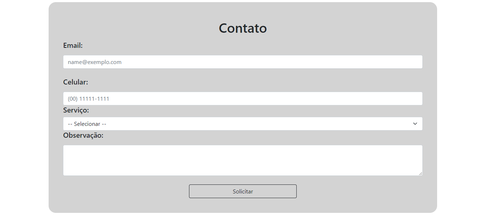

<h1> Av-Arcondicinado-LP </h1>

<h3>Landingpage</h3>

Neste Projeto, desenvolvi uma landingpage simples, com intuito de aplicar meus conhecimentos em HTML e CSS que eu possuia na época.

<h2>Imagens</h2>

HOME

Serviços

Contato

